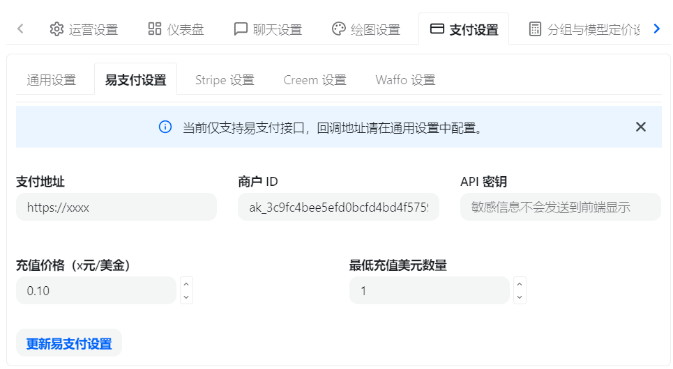
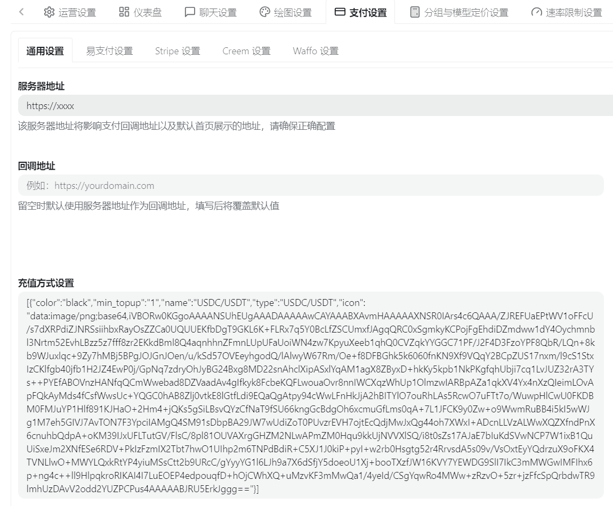
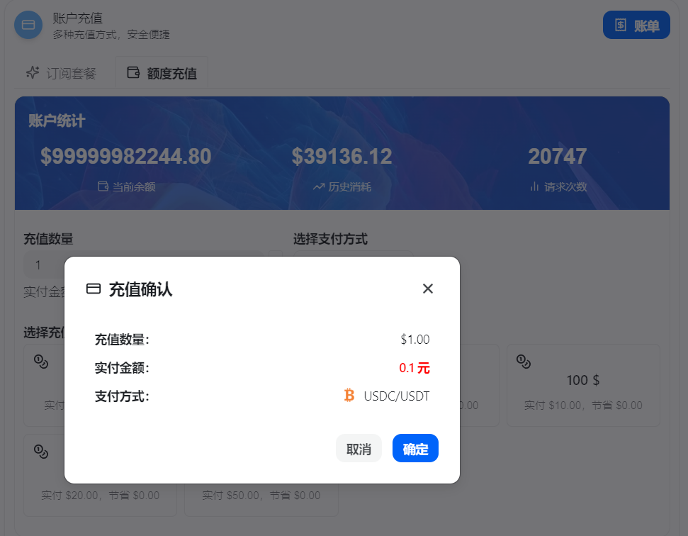

# ⚠️ Important Disclaimer / Disclaimer

> **This project is intended solely for developers to learn about blockchain, HD wallets, EVM stablecoin payment reception, and Webman project development practices.**  
> This open-source project does not constitute any investment advice, payment license advice, financial business advice, or production environment security guarantees. Any actions taken by the user based on this project—including deployment, modification, secondary development, payment reception, transfers, consolidation, or integration with third-party systems—are the sole responsibility of the user and are unrelated to the project author, maintainers, or contributors.
> Please do not use this project for any illegal or non-compliant purposes. Before involving real assets, please ensure you complete code audits, security hardening, permission isolation, private key management, risk control compliance, and thorough small-amount testing.

---

# 💎 HDupay

<p align="center">
  
  
  
  
  
  
</p>

**HDupay** is an open-source cryptocurrency stablecoin payment reception platform example project based on **Webman + Vue3 + Naive UI**. Its core goal is to demonstrate:

- 🧠 Mnemonic-based HD wallet system
- 🔗 EVM multi-network payment address derivation
- 💵 USDC / USDT stablecoin order reception
- 📡 RPC block scanning for monitoring and confirmation progress
- 🧾 OpenAPI / Epay compatible interfaces
- 🏦 Consolidation wallets, Gas wallets, and automatic consolidation tasks
- 🎛️ Complete business closed-loop in the backend management terminal

<p align="center">
  <a href="#features"><kbd>✨ Features</kbd></a>
  <a href="#networks"><kbd>🌍 Supported Networks</kbd></a>
  <a href="#currencies"><kbd>💵 Supported Currencies</kbd></a>
  <a href="#tech-stack"><kbd>🧱 Tech Stack</kbd></a>
  <a href="#modules"><kbd>🧩 System Modules</kbd></a>
  <a href="#requirements"><kbd>🖥️ Requirements</kbd></a>
  <a href="#install"><kbd>🚀 Quick Install</kbd></a>
  <br/>
  <a href="#access"><kbd>🔗 Access Points</kbd></a>
  <a href="#rpc-proxy"><kbd>📡 RPC & Proxy</kbd></a>
  <a href="#openapi"><kbd>🔌 OpenAPI</kbd></a>
  <a href="#epay"><kbd>🧩 Epay</kbd></a>
  <a href="#new-api"><kbd>🔗 New-Api Integration</kbd></a>
  <a href="#security"><kbd>🏦 Security Advice</kbd></a>
  <a href="#project-structure"><kbd>📁 Project Structure</kbd></a>
  <a href="#faq"><kbd>🛠️ FAQ</kbd></a>
</p>

---

<a id="features"></a>

## ✨ Features

| Module | Capability |
|---|---|
| 🔐 HD Wallet | Supports mnemonic root wallet initialization, network account derivation, and payment sub-address derivation |
| 🌐 Multi-Network | Currently supports four EVM mainnets: Ethereum, Base, Celo, and Polygon |
| 💰 Stablecoins | Currently supports USDC and USDT |
| 📦 Address Pool | Dynamically assigns one-time payment addresses after a user places an order; freezes upon timeout |
| 📡 On-chain Monitoring | Scans ERC20 Transfer logs via EVM RPC `eth_getLogs` |
| ✅ Block Confirmation | Confirms based on network-configured block counts; displays confirmation progress on the frontend |
| 🏦 Auto-Consolidation | Supports consolidation tasks, Gas replenishment, consolidation failure reasons, and retry counts |
| 🔌 OpenAPI | Provides open interfaces authenticated via API Key / API Secret |
| 🧩 Epay Compatibility | Provides a `/submit.php` redirect entry compatible with Epay protocol style |
| 🧭 RPC Management | Supports Infura, Dwellir, and OnFinality; supports grouping, polling, and retries |
| 🧦 Proxy Pool | Supports HTTP / HTTPS / SOCKS5 proxies and can force bind them to RPC requests |
| 📈 Exchange Rate Sync | Syncs USDC / USDT prices against multiple fiat currencies via CoinGecko |
| 🎨 Backend UI | Vue3 + Naive UI, providing a management dashboard, payment page, and QR code display |

---

<a id="networks"></a>

## 🌍 Supported Networks

| Network | Chain ID | Gas Native Coin | Status | Supported Stablecoins |
|---|---:|---|---|---|
| 🔷 Ethereum Mainnet | `1` | ETH | ✅ Supported | 🔵 USDC / 🟢 USDT |
| 🔵 Base Mainnet | `8453` | ETH | ✅ Supported | 🔵 USDC / 🟢 USDT |
| 🟡 Celo Mainnet | `42220` | CELO | ✅ Supported | 🔵 USDC / 🟢 USDT |
| 🟣 Polygon PoS Mainnet | `137` | POL | ✅ Supported | 🔵 USDC / 🟢 USDT |

> This project is primarily focused on **EVM networks**. If you need to integrate non-EVM networks such as Tron or Solana, you will need to implement additional address derivation, signing, scanning, and consolidation logic.

---

<a id="currencies"></a>

## 💵 Supported Currencies

### Cryptocurrencies

| Token | Name | Description |
|---|---|---|
| 🔵 USDC | USD Coin | One of the current default stablecoins |
| 🟢 USDT | Tether USD | One of the current default stablecoins |

### Fiat Exchange Rates

The exchange rate module currently supports common fiat currencies, such as:

`CNY`, `USD`, `EUR`, `CAD`, `AUD`, `JPY`, `HKD`, `GBP`, `SGD`

When placing an order, the system calculates the required amount of stablecoins based on the synchronized prices from the backend and rounds up according to the minimum granularity of the stablecoin.

---

<a id="tech-stack"></a>

## 🧱 Tech Stack

### Backend

| Technology | Purpose |
|---|---|
| 🐘 PHP 8.4+ | Runtime Environment |
| ⚡ Webman 2.x | HTTP Framework |
| 🚀 Workerman 5.x | Resident processes and high-performance network services |
| 🌀 Swoole Event Loop | Coroutine event loop support |
| 🗄️ webman/database | MySQL data access |
| 📡 Hyperf Guzzle | Coroutine-friendly HTTP client |
| 🔐 BitWasp Bitcoin | BIP39 / BIP32 capabilities |
| 🧮 web3p/ethereum-* | EVM address, signing, and transaction capabilities |
| 🧂 Sodium | Encryption for sensitive information |

### Frontend

| Technology | Purpose |
|---|---|
| 🟢 Vue 3 | Frontend Framework |
| ⚡ Vite | Build Tool |
| 🎨 Naive UI | Backend UI Component Library |
| 🧭 Vue Router | Frontend Routing |
| 🍍 Pinia | State Management |
| 🎯 TypeScript | Type Support |

---

<a id="modules"></a>

## 🧩 System Modules

```text
HDupay
├── 🎛️ Management Backend /hdupay
│   ├── Overview
│   ├── RPC Nodes / Network Config / Proxy Pool
│   ├── Wallet Settings / Consolidation Wallet / Gas Wallet
│   ├── Transaction Orders / Address Pool / Consolidation Records
│   └── API Settings / Exchange Rate Settings / System Settings
│
├── 💳 Public Payment Page /pay
│   ├── Network Selection
│   ├── Stablecoin Selection
│   ├── QR Code Display
│   └── On-chain Confirmation Progress
│
├── 🔌 OpenAPI /api/v1
│   ├── Query Available Networks
│   ├── Create Order
│   └── Query Order Status
│
└── 🧩 Epay Compatibility Entry /submit.php
```

---

<a id="requirements"></a>

## 🖥️ Running Environment Requirements

| Environment | Version Requirement |
|---|---|
| PHP | **8.4+** |
| MySQL | **5.7+**, 8.0+ recommended |
| Composer | **2.10+** |
| Node.js | 20+ recommended |
| NPM | 10+ recommended |
| Redis | Optional, recommended |
| Linux | Recommended for production environments |

### PHP Extension Requirements

Please ensure the following extensions are installed and enabled:

| Extension | Description |
|---|---|
| `swoole` | Recommended for Webman coroutine event loop |
| `pdo` / `pdo_mysql` | MySQL database connection |
| `sodium` | Encryption for mnemonic, API Secret, and other sensitive info |
| `gmp` | Dependency for HD wallet / elliptic curve calculations |
| `bcmath` | High-precision numerical calculations |
| `openssl` | Encryption and random number capabilities |
| `curl` | Guzzle HTTP requests and proxy support |
| `mbstring` | String handling |
| `json` | JSON encoding/decoding |
| `ctype` / `filter` / `iconv` / `session` | Basic capabilities for Webman and dependencies |
| `pcntl` / `posix` | Workerman process management on Linux |
| `opcache` | Recommended for production |
| `redis` | Recommended if using Redis capabilities |

Verification example:

```bash
php -v
php -m | grep -E "swoole|pdo_mysql|sodium|gmp|bcmath|openssl|curl|mbstring|pcntl|posix|redis"
composer -V
```

---

<a id="install"></a>

## 🚀 Quick Install

### 1️⃣ Clone Project

```bash
git clone <your-repository-url> HDupay
cd HDupay
```

### 2️⃣ Install Backend Dependencies

```bash
composer install
```

For production environments:

```bash
composer install --no-dev --optimize-autoloader
```

### 3️⃣ Import Database

First, prepare the target database (e.g., `hdupay`), then import the project SQL file:

```bash
mysql -uroot -p hdupay < database/schema.sql
```

Then modify the database connection configuration:

```text
config/database.php
```

If this file doesn't exist in the project, copy the example file first:

```bash
cp config/database.example.php config/database.php
```

Modify according to your actual environment:

```php
'host'     => '127.0.0.1',
'port'     => '3306',
'database' => 'hdupay',
'username' => 'your_user',
'password' => 'your_password',
```

> ⚠️ Do not use weak passwords in production; it is recommended to grant the database account only the permissions required for the current database.

---

## 🔐 Create `.env` File

An `.env` file must be created in the project root to store sensitive configurations.

If `.env.example` is missing, you can create it manually:

```bash
cat > .env <<'EOF'
# Required: Encryption key for wallets, API Secrets, and other sensitive info
# Generation method: php -r "echo bin2hex(random_bytes(32)), PHP_EOL;"
WALLET_ENCRYPTION_KEY=ReplaceWith64CharRandomHexString
EOF
```

Generate a secure key:

```bash
php -r "echo bin2hex(random_bytes(32)), PHP_EOL;"
```

You can use other encryption methods to generate this key; just copy the resulting string into the file.

> 🔥 **Important:** Once the system is officially used and encrypted data is written, do not change `WALLET_ENCRYPTION_KEY` casually, otherwise previously encrypted sensitive information may become undecryptable.

---

## 🎨 Frontend Install and Build

> 💡 Tip: Installation does not require building; the project is pre-compiled by default. You only need to re-run the build command when modifying the `web/` frontend source code.

The frontend project is located at:

```text
web/
```

Install dependencies:

```bash
cd web
npm install
```

Development mode:

```bash
npm run dev
```

Build production artifacts:

```bash
npm run build
```

The built files will be output to the project root:

```text
public/
```

---

## ▶️ Start Project

### Development Mode

```bash
php webman start
```

Or:

```bash
php start.php start
```

Default listening address:

```text
http://127.0.0.1:2828
```

### Daemon Mode

```bash
php webman start -d
```

Common commands:

```bash
php webman status
php webman restart
php webman stop
```

For local development on Windows, you can try:

```bash
php windows.php
```

---

<a id="access"></a>

## 🔗 Access Points

| Entry | Path | Description |
|---|---|---|
| 🎛️ Management Backend | `/hdupay/login` | Admin login entry |
| 💳 Payment Page | `/pay` | Public user payment page |
| 🔌 OpenAPI | `/api/v1` | API call entry |
| 🧩 Epay Compatible | `/submit.php` | Epay protocol style redirect entry |
| 🛡️ Management API | `/admin` | Backend API prefix |

Examples:

```text
http://127.0.0.1:2828/hdupay/login
http://127.0.0.1:2828/pay
```

---

### 🔐 Default Admin

After importing `database/schema.sql`, a default administrator account is created:

| Item | Content |
|---|---|
| Login URL | `/hdupay/login` |
| Username | `admin` |
| Password | `Admin@123456` |

> ⚠️ Please go to "System Settings" to change the admin username and password immediately after the first login.

---

<a id="rpc-proxy"></a>

## 📡 RPC & Proxy

Currently supported RPC providers:

| Provider | Status | Description |
|---|---|---|
| Infura | ✅ | Supports API Key Secret |
| Dwellir | ✅ | API Key mode |
| OnFinality | ✅ | API Key mode |

Proxy pool support:

- 🌐 HTTP
- 🔒 HTTPS
- 🧦 SOCKS5 / SOCKS5H

> If an RPC node is bound to a proxy, the request will be forced through the proxy and will not automatically fall back to a direct connection. This allows for clear differentiation between proxy failures and RPC failures.

---

<a id="openapi"></a>

## 🔌 OpenAPI Brief Description

OpenAPI uniformly uses:

```text
POST /api/v1
```

Authentication method:

```http
x-api-key:     your_api_key
x-api-secret:  your_api_secret
```

Interface list:

| Interface | Method | Description |
|---|---|---|
| `/api/v1/networks` | POST | Query currently available payment networks |
| `/api/v1/orders/create` | POST | Create a payment order and return the payment link |
| `/api/v1/orders/status` | POST | Query order payment status and percentage progress |

---

<a id="epay"></a>

## 🧩 Epay Compatibility Entry

The project provides an Epay-style entry:

```text
GET/POST /submit.php
```

Description:

- `pid` reuses the API Key from the backend OpenAPI.
- The signing key reuses the API Key Secret.
- The `type` field is accepted for compatibility, but the system does not rely on it to determine the payment method.
- Upon success, it returns a redirectable `/pay?epay_order=...` payment page.

---

<a id="new-api"></a>

## 🔗 New-Api Integration

HDupay provides a `/submit.php` Epay compatible entry, allowing it to be integrated as an Epay payment channel in New-Api. Before integrating, please add an API in the HDupay backend "API Settings" to obtain the API Key and API Secret.

### 1️⃣ Configure Epay Channel

In the New-Api backend, select the "Epay" configuration and fill in the API information created in the HDupay backend:

| New-Api Config Item | Content to Fill |
|---|---|
| Epay Gateway / Interface Address | `https://your-hdupay-domain/submit.php` |
| PID / Merchant ID | API Key created in HDupay backend |
| Key / Communication Secret | API Secret created in HDupay backend |



### 2️⃣ Modify Deposit Method Settings

Replace the deposit method settings in New-Api with the following content; simply copy and save:

```json
[
  {
    "color": "black",
    "min_topup": "1",
    "name": "USDC/USDT",
    "type": "USDC/USDT",
    "icon": "data:image/png;base64,iVBORw0KGgoAAAANSUhEUgAAADAAAAAwCAYAAABXAvmHAAAAAXNSR0IArs4c6QAAA/ZJREFUaEPtWV1oFFcU/s7dXRPdiZJNRSsiihbxRayOsZZCa0UQUUEKfbDgT9GKL6K+FLRx7q5Y0BcLfZSCUmxfJAgqQRC0xSgmkyKCPojFgEhdiDZmdww1dY4Oychmnbl3Nrtm52EvhLBzz5z7fff8zr2EKkdBml8Q4aqnhhnZFmnLUpUFaUoiWN4zw7KpyuXeeb1qhQ0CVZqkYYGGC71PF/J2F4D3FzoYPF8QbR/LQn+8kb9WJuxlqc+9Zy7hMBj5BPgJOJGnJOen/u/kSd57OVEeyhgodQ/lAlwyW67Rm/Oe+f8DFBGhk5k6060fnKN9Xf9VQqY2BCpZUS17nxm/l9cS1StxIzCKlfgb40jfb1H2JZ4EwP0j/GpNq7zdryOhJyBG24Bxg8MD22snAhclXipASxlYqAM1agX8ZByxD+hkKy5kpb1NkPKgfqhUbji7cq1LvJUZ32rA3TYs++PYEfABOVnzHANfqQCmWwebad8DZVaadAv4gIfkyk8FcbeKQFLwouaOvr8nnIWCXqzWhUp1OlmzwIARBpAZa1qkXV4Yx4nXzQIeimLOvApFQkAyMds4fCsfWwsUc+YQGC0hAB8Zlj0vtkE8lGtfLdi9EQaQgAtpy94cWwLFnHkJjA2hBITYlO7ouRhLAs5RcwO7uFTt7o/WuwpHlCwU0FKDBM0FMJuYP1Hlf891KJHaO+2Hm4+jQKs5gSiLBsvQYzCfNaT9fSU66kngGcBdgOh6xcmuGfLms0qA+7L1JFCK9y0Zw+o9WwmRuBB4i5kI5wWJg1M7eh5GIVJ7AvTON7F3YpciIAMgQ4SM91sDbpBA29JW7wUdiZoT0PUvzrEVH7ojtEcQdjMwJxQg44oh7XWxI+ADcnLLVzALWwXQZXfndPnX6cnuhbQdpA+oKM39IJxUFLtutGV/FlsC/8pl81OUVAXrgGHZM2NLwAPmZM0Hqu9kkUjNVVXlSQ/i8t0sZs17AJaE7bIuKdSVwNCP7W1ixB1QuUiSxeJm2XNfESe6RDV+PkIzFzmIX2Tbt7hwO1UIhp2m6TNPdBdiR+C5XJ1J0kiP+pyI+w2rb0Hsgtg52r4RrvsdA5s09v/VsOxtEyYQdrzuX9oFKX4TVNLlwO+MWYLQxkRtYP4yiuMSsCtt2b9URcC/gYyyYG1l6LJh9a7X6dSfjY5doeoU1Xj+booTXzfJW16KVY7YEWDG9SlI7IkC3mMWGwIMFIhx6p+ng4c++ll9HlpqkroRIKAI4I7LuEOEP4edpouqfD+hOjCWhXQ+uMzvKF3mMwQa1/4yeId/CSgYqwRo4MWw+zRzvO+5zr+jzFfcSpQrbdwTR9lmhUzDAvV2odd2YUZPCPus4AAAAABJRU5ErkJggg=="
  }
]
```



### 3️⃣ User Clicks Deposit

After the user clicks `USDC/USDT` on the New-Api deposit page, they will be redirected to the HDupay payment page to complete the stablecoin payment.



---

<a id="security"></a>

## 🏦 Wallet and Asset Security Advice

> Wallet-related functions involve real on-chain assets; please use them with caution.

Suggestions:

- 🔐 Root mnemonics must be backed up offline; no screenshots, no cloud uploads.
- 🧊 For production environments, it is recommended to use independent servers, independent databases, and minimum-privilege accounts.
- 🧪 Perform full tests for payment reception, confirmation, and consolidation with small assets before going live.
- 🧱 It is recommended to add firewalls, backend access restrictions, HTTPS, WAF, and log auditing.
- 🧾 RPC Keys, API Secrets, and wallet keys must not be written into code or committed to the repository.
- 🔍 Please undergo a professional security audit before actual commercial use.

---

<a id="project-structure"></a>

## 📁 Project Structure

```text
HDupay
├── app/
│   ├── controller/        # Controllers
│   ├── service/           # Business Logic
│   ├── model/             # Data Models
│   └── process/           # Resident Processes: Monitoring, Consolidation, Exchange Rate Sync
│
├── config/                # Webman config, routes, processes, database, chain config
├── database/              # schema.sql database structure
├── docs/                  # Documentation images and descriptive materials
├── public/                # Frontend build artifacts and static resources
├── scripts/               # Data migration scripts
├── support/               # Webman support files
├── web/                   # Vue3 + Vite + Naive UI frontend project
├── webman                 # Webman command entry
├── start.php              # Start entry
└── README.md              # Project documentation
```

---

<a id="faq"></a>

## 🛠️ FAQ

### 1. Prompt: `WALLET_ENCRYPTION_KEY` not configured

Please check if the `.env` file exists in the project root and confirm it contains:

```env
WALLET_ENCRYPTION_KEY=Your64CharRandomHexString
```

Restart after modification:

```bash
php webman restart
```

### 2. RPC Test Failed

Please check:

- Is the RPC URL correct?
- Is the API Key valid?
- Does the current network match the RPC address?
- If bound to a proxy, is the proxy available?
- Is the firewall blocking external requests?

### 3. Frontend page is not updating

Please re-compile the frontend:

```bash
cd web
npm run build
```

Then restart the backend service or refresh the browser cache.

### 4. Transfer completed on-chain but order not confirmed

Please check:

- Is the RPC node functioning normally?
- Is automatic monitoring enabled in the network configuration?
- Is the contract address correct?
- Is the confirmation block count too high?
- Is the scanning step size reasonable?
- Does the order address match the on-chain receiving address?

---

## 📜 License

This project is released under an open-source license. For details, please see the project root:

```text
LICENSE
```

---

## ❤️ To Developers

If you are learning about:

- HD Wallets
- EVM Address Derivation
- ERC20 Payment Monitoring
- Webman Resident Processes
- Vue3 Backend Management Systems
- OpenAPI Payment Interface Design

Then HDupay can serve as a complete reference project for your learning.  
Please remember: **Between a learning environment and a production environment, there is a vast amount of work to be done regarding security, compliance, risk control, auditing, and operations.**

---

## 🌐 Community

This open-source project is linked with and recognizes the [LINUX DO](https://linux.do) community.
