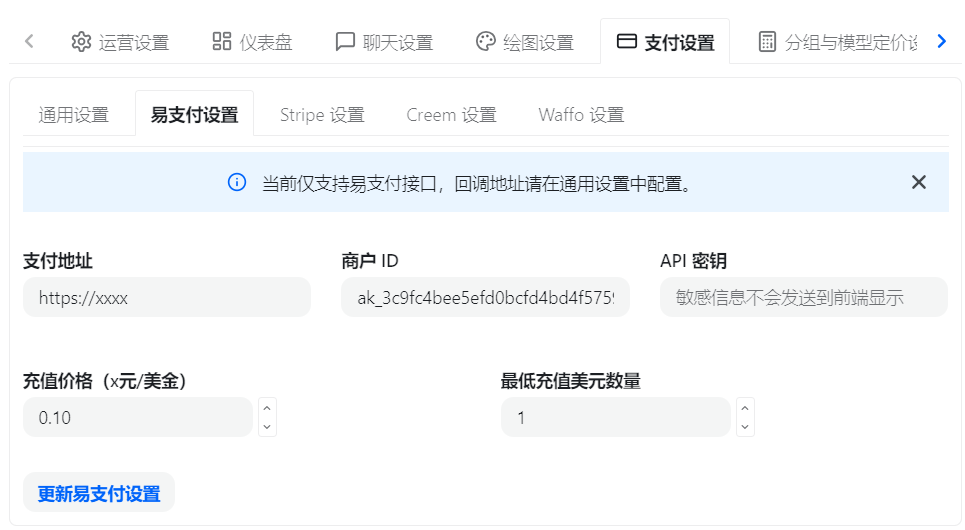
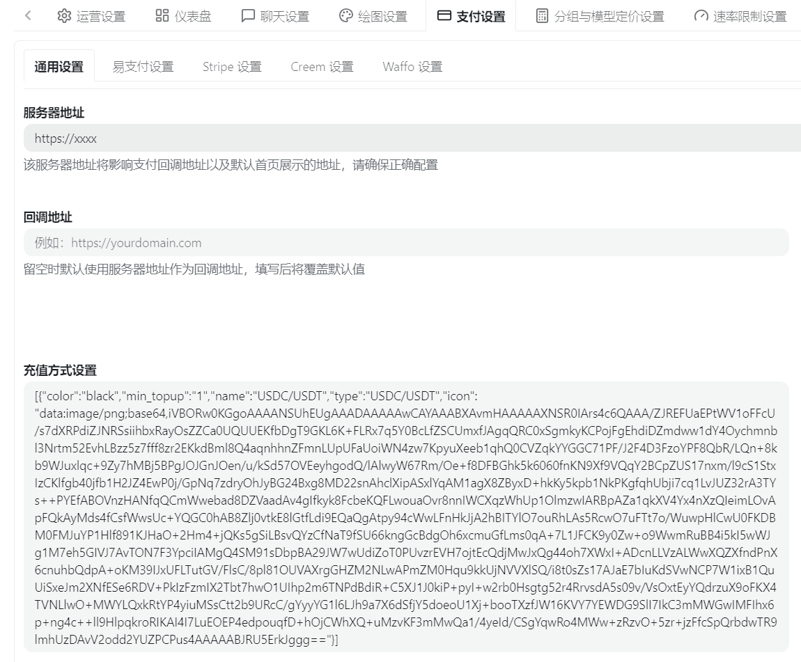
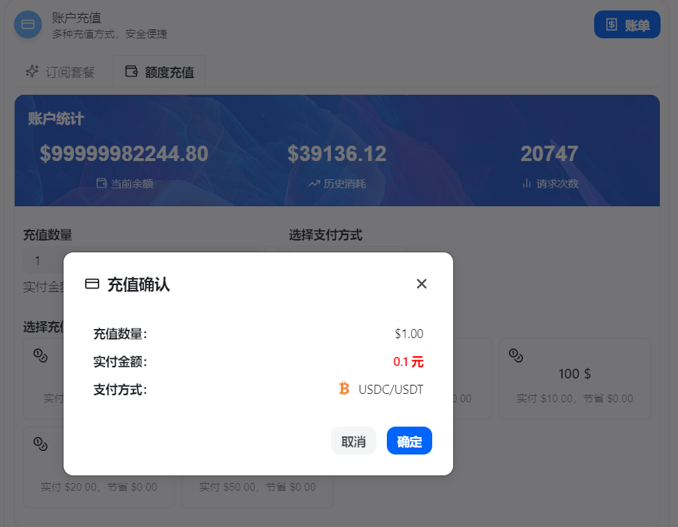

# ⚠️ 重要声明 / Disclaimer

> **本项目仅用于开发者学习区块链、HD 钱包、EVM 稳定币收款与 Webman 项目开发实践。**  
> 本开源项目不构成任何投资建议、支付牌照建议、金融业务建议或生产环境安全承诺。使用者基于本项目进行部署、改造、二次开发、收款、转账、归集、提现、对接第三方系统等任何行为，均由使用者自行承担全部责任，与本项目作者、维护者及贡献者无关。  
> 请勿将本项目用于任何违法违规用途。涉及真实资产前，请务必完成代码审计、安全加固、权限隔离、私钥管理、风控合规与小额充分测试。

---

# 💎 HDupay

<p align="center">
  
  
  
  
  
  
</p>

**HDupay** 是一个基于 **Webman + Vue3 + Naive UI** 的开源加密货币稳定币收款平台示例项目，核心目标是演示：

- 🧠 基于助记词的 HD 钱包体系
- 🔗 EVM 多网络收款地址派生
- 💵 USDC / USDT 稳定币订单收款
- 📡 RPC 扫块监听与确认进度
- 🧾 OpenAPI / 易支付兼容接口
- 🏦 归集钱包、Gas 钱包与自动归集任务
- 🎛️ 后台管理端的完整业务闭环

<p align="center">
  <a href="#features"><kbd>✨ 项目亮点</kbd></a>
  <a href="#networks"><kbd>🌍 支持网络</kbd></a>
  <a href="#currencies"><kbd>💵 支持货币</kbd></a>
  <a href="#tech-stack"><kbd>🧱 技术栈</kbd></a>
  <a href="#modules"><kbd>🧩 系统模块</kbd></a>
  <a href="#requirements"><kbd>🖥️ 运行环境</kbd></a>
  <a href="#install"><kbd>🚀 快速安装</kbd></a>
  <br/>
  <a href="#access"><kbd>🔗 访问入口</kbd></a>
  <a href="#rpc-proxy"><kbd>📡 RPC 与代理</kbd></a>
  <a href="#openapi"><kbd>🔌 OpenAPI</kbd></a>
  <a href="#epay"><kbd>🧩 易支付</kbd></a>
  <a href="#new-api"><kbd>🔗 New-Api 接入</kbd></a>
  <a href="#security"><kbd>🏦 安全建议</kbd></a>
  <a href="#project-structure"><kbd>📁 项目结构</kbd></a>
  <a href="#faq"><kbd>🛠️ 常见问题</kbd></a>
</p>

---

<a id="features"></a>

## ✨ 项目亮点

| 模块 | 能力 |
|---|---|
| 🔐 HD 钱包 | 支持助记词初始化根钱包、网络账户派生、收款子地址派生 |
| 🌐 多网络 | 当前支持 Ethereum、Base、Celo、Polygon 四条 EVM 主网 |
| 💰 稳定币 | 当前支持 USDC、USDT |
| 📦 地址池 | 用户下单后动态分配一次性收款地址，超时冻结 |
| 📡 链上监听 | 通过 EVM RPC `eth_getLogs` 扫描 ERC20 Transfer 日志 |
| ✅ 区块确认 | 按网络配置确认块数，前端显示确认进度 |
| 🏦 自动归集 | 支持归集任务、Gas 补充、归集失败原因与重试次数 |
| 🚀 转出任务 | 支持本地归集钱包转出到后台配置的目标地址 |
| 🔌 OpenAPI | 提供 API Key / API Secret 鉴权的开放接口 |
| 🧩 易支付兼容 | 提供 `/submit.php` 兼容易支付协议风格的跳转入口 |
| 🧭 RPC 管理 | 支持 Infura、Dwellir、OnFinality，支持分组、轮询与重试 |
| 🧦 代理池 | 支持 HTTP / HTTPS / SOCKS5 代理，并可强制绑定 RPC 请求 |
| 📈 汇率同步 | 通过 CoinGecko 同步 USDC / USDT 对多法币价格 |
| 🎨 后台 UI | Vue3 + Naive UI，提供管理后台、支付页、二维码展示 |

---

<a id="networks"></a>

## 🌍 支持网络

| 网络 | Chain ID | Gas 原生币 | 当前状态 | 支持稳定币 |
|---|---:|---|---|---|
| 🔷 Ethereum Mainnet | `1` | ETH | ✅ 已支持 | 🔵 USDC / 🟢 USDT |
| 🔵 Base Mainnet | `8453` | ETH | ✅ 已支持 | 🔵 USDC / 🟢 USDT |
| 🟡 Celo Mainnet | `42220` | CELO | ✅ 已支持 | 🔵 USDC / 🟢 USDT |
| 🟣 Polygon PoS Mainnet | `137` | POL | ✅ 已支持 | 🔵 USDC / 🟢 USDT |

> 当前项目主要面向 **EVM 网络**。如果需要接入 Tron、Solana 等非 EVM 网络，需要额外实现地址派生、签名、扫描与归集逻辑。

---

<a id="currencies"></a>

## 💵 支持货币

### 加密货币

| 代币 | 名称 | 说明 |
|---|---|---|
| 🔵 USDC | USD Coin | 当前默认稳定币之一 |
| 🟢 USDT | Tether USD | 当前默认稳定币之一 |

### 法币汇率

当前汇率模块支持常见法币，例如：

`CNY`、`USD`、`EUR`、`CAD`、`AUD`、`JPY`、`HKD`、`GBP`、`SGD`

下单时系统会根据后台同步的稳定币价格计算应付稳定币数量，并按稳定币最小颗粒度向上取整。

---

<a id="tech-stack"></a>

## 🧱 技术栈

### 后端

| 技术 | 用途 |
|---|---|
| 🐘 PHP 8.4+ | 运行环境 |
| ⚡ Webman 2.x | HTTP 框架 |
| 🚀 Workerman 5.x | 常驻进程与高性能网络服务 |
| 🌀 Swoole Event Loop | 协程事件循环支持 |
| 🗄️ webman/database | MySQL 数据访问 |
| 📡 Hyperf Guzzle | 协程友好的 HTTP 客户端 |
| 🔐 BitWasp Bitcoin | BIP39 / BIP32 相关能力 |
| 🧮 web3p/ethereum-* | EVM 地址、签名、交易相关能力 |
| 🧂 Sodium | 敏感信息加密 |

### 前端

| 技术 | 用途 |
|---|---|
| 🟢 Vue 3 | 前端框架 |
| ⚡ Vite | 构建工具 |
| 🎨 Naive UI | 后台 UI 组件库 |
| 🧭 Vue Router | 前端路由 |
| 🍍 Pinia | 状态管理 |
| 🎯 TypeScript | 类型支持 |

---

<a id="modules"></a>

## 🧩 系统模块

```text
HDupay
├── 🎛️ 管理后台 /hdupay
│   ├── 概览
│   ├── RPC 节点 / 网络配置 / 代理池
│   ├── 钱包设置 / 归集钱包 / Gas 钱包
│   ├── 交易订单 / 地址池 / 归集记录 / 转出记录
│   └── API 设置 / 汇率设置 / 系统设置
│
├── 💳 公共支付页 /pay
│   ├── 网络选择
│   ├── 稳定币选择
│   ├── 二维码展示
│   └── 链上确认进度
│
├── 🔌 OpenAPI /api/v1
│   ├── 查询可用网络
│   ├── 创建订单
│   └── 查询订单状态
│
└── 🧩 易支付兼容入口 /submit.php
```

---

<a id="requirements"></a>

## 🖥️ 运行环境要求

| 环境 | 版本要求 |
|---|---|
| PHP | **8.4+** |
| MySQL | **5.7+**，推荐 8.0+ |
| Composer | **2.10+** |
| Node.js | 推荐 20+ |
| NPM | 推荐 10+ |
| Redis | 可选，推荐安装 |
| Linux | 推荐生产环境使用 Linux |

### PHP 扩展要求

请确认以下扩展已安装并启用：

| 扩展 | 说明 |
|---|---|
| `swoole` | Webman 协程事件循环建议使用 |
| `pdo` / `pdo_mysql` | MySQL 数据库连接 |
| `sodium` | 钱包助记词、API Secret 等敏感信息加密 |
| `gmp` | HD 钱包 / 椭圆曲线计算依赖 |
| `bcmath` | 高精度数值计算 |
| `openssl` | 加密与随机数能力 |
| `curl` | Guzzle HTTP 请求与代理支持 |
| `mbstring` | 字符串处理 |
| `json` | JSON 编解码 |
| `ctype` / `filter` / `iconv` / `session` | Webman 与依赖包基础能力 |
| `pcntl` / `posix` | Linux 下 Workerman 进程管理 |
| `opcache` | 生产环境推荐 |
| `redis` | 如果启用 Redis 相关能力建议安装 |

检查示例：

```bash
php -v
php -m | grep -E "swoole|pdo_mysql|sodium|gmp|bcmath|openssl|curl|mbstring|pcntl|posix|redis"
composer -V
```

---

<a id="install"></a>

## 🚀 快速安装

### 1️⃣ 克隆项目

```bash
git clone <your-repository-url> HDupay
cd HDupay
```

### 2️⃣ 安装后端依赖

```bash
composer install
```

生产环境可使用：

```bash
composer install --no-dev --optimize-autoloader
```

### 3️⃣ 导入数据库

请先准备好目标数据库（如 `hdupay`），然后导入项目 SQL 文件：

```bash
mysql -uroot -p hdupay < database/schema.sql
```

然后修改数据库连接配置：

```text
config/database.php
```

如果项目中没有该文件，可以先复制示例文件：

```bash
cp config/database.example.php config/database.php
```

请根据你的实际环境修改：

```php
'host'     => '127.0.0.1',
'port'     => '3306',
'database' => 'hdupay',
'username' => 'your_user',
'password' => 'your_password',
```

> ⚠️ 生产环境请勿使用弱密码，数据库账号建议只授予当前库所需权限。

---

## 🔐 创建 `.env` 文件

项目根目录需要创建 `.env` 文件，用于保存敏感配置。

如果项目中没有 `.env.example`，可以手动创建：

```bash
cat > .env <<'EOF'
# 必填：钱包、API Secret 等敏感信息加密密钥
# 生成方式：php -r "echo bin2hex(random_bytes(32)), PHP_EOL;"
WALLET_ENCRYPTION_KEY=请替换为64位随机hex字符串

EOF
```

生成安全密钥：

```bash
php -r "echo bin2hex(random_bytes(32)), PHP_EOL;"
```

这个秘钥可以自己使用其他加密方式生成，生成后复制进去就行。

> 🔥 **重要：** 一旦正式使用并写入加密数据后，不要随意更换 `WALLET_ENCRYPTION_KEY`，否则可能导致已加密的敏感信息无法解密。

---

## 🎨 前端安装与编译

> 💡 提示：安装不需要编译，项目默认已编译。只有修改 `web/` 前端源码时，才需要重新执行编译命令。

前端项目位于：

```text
web/
```

安装依赖：

```bash
cd web
npm install
```

开发模式：

```bash
npm run dev
```

编译生产产物：

```bash
npm run build
```

编译后的文件会输出到项目根目录：

```text
public/
```

---

## ▶️ 启动项目

### 开发模式

```bash
php webman start
```

或：

```bash
php start.php start
```

默认监听：

```text
http://127.0.0.1:2828
```

### 守护进程模式

```bash
php webman start -d
```

常用命令：

```bash
php webman status
php webman restart
php webman stop
```

Windows 本地开发可尝试：

```bash
php windows.php
```

---

<a id="access"></a>

## 🔗 访问入口

| 入口 | 路径 | 说明 |
|---|---|---|
| 🎛️ 管理后台 | `/hdupay/login` | 管理员登录入口 |
| 💳 支付页面 | `/pay` | 用户公开收款页面 |
| 🔌 OpenAPI | `/api/v1` | API 调用入口 |
| 🧩 易支付兼容 | `/submit.php` | 易支付协议风格跳转入口 |
| 🛡️ 管理接口 | `/admin` | 后台接口前缀 |

示例：

```text
http://127.0.0.1:2828/hdupay/login
http://127.0.0.1:2828/pay
```

---

### 🔐 默认管理员

导入 `database/schema.sql` 后，会写入一个默认管理员账号：

| 项目 | 内容 |
|---|---|
| 登录地址 | `/hdupay/login` |
| 账号 | `admin` |
| 密码 | `Admin@123456` |

> ⚠️ 首次登录后请立即进入「系统设置」修改管理员账号和密码。

---

<a id="rpc-proxy"></a>

## 📡 RPC 与代理

当前支持的 RPC 提供商：

| 提供商 | 支持情况 | 说明 |
|---|---|---|
| Infura | ✅ | 支持 API Key Secret |
| Dwellir | ✅ | API Key 模式 |
| OnFinality | ✅ | API Key 模式 |

代理池支持：

- 🌐 HTTP
- 🔒 HTTPS
- 🧦 SOCKS5 / SOCKS5H

> 如果 RPC 节点绑定了代理，请求会强制走代理，不会自动回退直连。这样可以明确区分代理故障与 RPC 故障。

---

<a id="openapi"></a>

## 🔌 OpenAPI 简要说明

OpenAPI 统一使用：

```text
POST /api/v1
```

鉴权方式：

```http
x-api-key:     your_api_key
x-api-secret:  your_api_secret
```

接口列表：

| 接口 | 方法 | 说明 |
|---|---|---|
| `/api/v1/networks` | POST | 查询当前可用收款网络 |
| `/api/v1/orders/create` | POST | 创建支付订单，返回支付链接 |
| `/api/v1/orders/status` | POST | 查询订单支付状态与百分比进度 |

---

<a id="epay"></a>

## 🧩 易支付兼容入口

项目提供易支付风格入口：

```text
GET/POST /submit.php
```

说明：

- `pid` 复用后台 OpenAPI 的 API Key
- 签名密钥复用 API Key Secret
- `type` 字段会被兼容接收，但系统不依赖该字段决定支付方式
- 成功后返回可跳转的 `/pay?epay_order=...` 支付页面

---

<a id="new-api"></a>

## 🔗 New-Api 接入

HDupay 提供 `/submit.php` 易支付兼容入口，可以接入 New-Api 的易支付支付渠道。接入前请先在 HDupay 后台「API 设置」中添加 API，获取 API Key 和 API Secret。

### 1️⃣ 配置易支付通道

在 New-Api 后台选择「易支付」配置，填写 HDupay 后台创建的 API 信息：

| New-Api 配置项 | 填写内容 |
|---|---|
| 易支付网关 / 接口地址 | `https://你的HDupay域名/submit.php` |
| PID / 商户 ID | HDupay 后台创建的 API Key |
| Key / 通信密钥 | HDupay 后台创建的 API Secret |



### 2️⃣ 修改充值方式设置

把 New-Api 的充值方式设置替换为下面内容，直接复制进去保存即可：

```json
[
  {
    "color": "black",
    "min_topup": "1",
    "name": "USDC/USDT",
    "type": "USDC/USDT",
    "icon": "data:image/png;base64,iVBORw0KGgoAAAANSUhEUgAAADAAAAAwCAYAAABXAvmHAAAAAXNSR0IArs4c6QAAA/ZJREFUaEPtWV1oFFcU/s7dXRPdiZJNRSsiihbxRayOsZZCa0UQUUEKfbDgT9GKL6K+FLRx7q5Y0BcLfZSCUmxfJAgqQRC0xSgmkyKCPojFgEhdiDZmdww1dY4Oychmnbl3Nrtm52EvhLBzz5z7fff8zr2EKkdBml8Q4aqnhhnZFmnLUpUFaUoiWN4zw7KpyuXeeb1qhQ0CVZqkYYGGC71PF/J2F4D3FzoYPF8QbR/LQn+8kb9WJuxlqc+9Zy7hMBj5BPgJOJGnJOen/u/kSd57OVEeyhgodQ/lAlwyW67Rm/Oe+f8DFBGhk5k6060fnKN9Xf9VQqY2BCpZUS17nxm/l9cS1StxIzCKlfgb40jfb1H2JZ4EwP0j/GpNq7zdryOhJyBG24Bxg8MD22snAhclXipASxlYqAM1agX8ZByxD+hkKy5kpb1NkPKgfqhUbji7cq1LvJUZ32rA3TYs++PYEfABOVnzHANfqQCmWwebad8DZVaadAv4gIfkyk8FcbeKQFLwouaOvr8nnIWCXqzWhUp1OlmzwIARBpAZa1qkXV4Yx4nXzQIeimLOvApFQkAyMds4fCsfWwsUc+YQGC0hAB8Zlj0vtkE8lGtfLdi9EQaQgAtpy94cWwLFnHkJjA2hBITYlO7ouRhLAs5RcwO7uFTt7o/WuwpHlCwU0FKDBM0FMJuYP1Hlf891KJHaO+2Hm4+jQKs5gSiLBsvQYzCfNaT9fSU66kngGcBdgOh6xcmuGfLms0qA+7L1JFCK9y0Zw+o9WwmRuBB4i5kI5wWJg1M7eh5GIVJ7AvTON7F3YpciIAMgQ4SM91sDbpBA29JW7wUdiZoT0PUvzrEVH7ojtEcQdjMwJxQg44oh7XWxI+ADcnLLVzALWwXQZXfndPnX6cnuhbQdpA+oKM39IJxUFLTutGV/FlsC/8pl81OUVAXrgGHZM2NLwAPmZM0Hqu9kkUjNVVXlSQ/i8t0sZs17AJaE7bIuKdSVwNCP7W1ixB1QuUiSxeJm2XNfESe6RDV+PkIzFzmIX2Tbt7hwO1UIhp2m6TNPdBdiR+C5XJ1J0kiP+pyI+w2rb0Hsgtg52r4RrvsdA5s09v/VsOxtEyYQdrzuX9oFKX4TVNLlwO+MWYLQxkRtYP4yiuMSsCtt2b9URcC/gYyyYG1l6LJh9a7X6dSfjY5doeoU1Xj+booTXzfJW16KVY7YEWDG9SlI7IkC3mMWGwIMFIhx6p+ng4c++ll9HlpqkroRIKAI4I7LuEOEP4edpouqfD+hOjCWhXQ+uMzvKF3mMwQa1/4yeId/CSgYqwRo4MWw+zRzvO+5zr+jzFfcSpQrbdwTR9lmhUzDAvV2odd2YUZPCPus4AAAAABJRU5ErkJggg=="
  }
]
```



### 3️⃣ 用户点击充值

用户在 New-Api 充值页面点击 `USDC/USDT` 后，会跳转到 HDupay 支付页面完成稳定币付款。



---

<a id="security"></a>

## 🏦 钱包与资产安全建议

> 钱包相关功能涉及真实链上资产，请谨慎使用。

建议：

- 🔐 根助记词必须离线备份，禁止截图、禁止上传网盘
- 🧊 生产环境建议使用独立服务器、独立数据库、最小权限账号
- 🧪 上线前先用小额资产完整测试收款、确认、归集、转出
- 🧱 建议增加防火墙、后台访问限制、HTTPS、WAF、日志审计
- 🧾 RPC Key、API Secret、钱包密钥不得写入代码或提交仓库
- 🔍 真实商用前请进行专业安全审计

---

<a id="project-structure"></a>

## 📁 项目结构

```text
HDupay
├── app/
│   ├── controller/        # 控制器
│   ├── service/           # 业务逻辑
│   ├── model/             # 数据模型
│   └── process/           # 常驻进程：监听、归集、转出、汇率同步
│
├── config/                # Webman 配置、路由、进程、数据库、链配置
├── database/              # schema.sql 数据库结构
├── docs/                  # 文档图片与说明素材
├── public/                # 前端编译产物与静态资源
├── scripts/               # 数据迁移脚本
├── support/               # Webman 支撑文件
├── web/                   # Vue3 + Vite + Naive UI 前端项目
├── webman                 # Webman 命令入口
├── start.php              # 启动入口
└── README.md              # 项目说明文档
```

---

<a id="faq"></a>

## 🛠️ 常见问题

### 1. 提示未配置 `WALLET_ENCRYPTION_KEY`

请检查项目根目录 `.env` 是否存在，并确认包含：

```env
WALLET_ENCRYPTION_KEY=你的64位随机hex字符串
```

修改后需要重启：

```bash
php webman restart
```

### 2. RPC 测试失败

请检查：

- RPC URL 是否正确
- API Key 是否有效
- 当前网络是否和 RPC 地址匹配
- 如果绑定代理，代理是否可用
- 防火墙是否阻断外部请求

### 3. 前端页面没有更新

请重新编译前端：

```bash
cd web
npm run build
```

然后重启后端服务或刷新浏览器缓存。

### 4. 链上已转账但订单未确认

请检查：

- RPC 节点是否正常
- 网络配置是否启用自动监听
- 合约地址是否正确
- 确认块数是否过大
- 扫描步长是否合理
- 订单地址是否和链上收款地址一致

---

## 📜 License

本项目基于开源协议发布，具体请查看项目根目录：

```text
LICENSE
```

---

## ❤️ 致开发者

如果你正在学习：

- HD 钱包
- EVM 地址派生
- ERC20 收款监听
- Webman 常驻进程
- Vue3 后台管理系统
- OpenAPI 支付接口设计

那么 HDupay 可以作为一个完整的学习参考项目。  
请记住：**学习环境和生产环境之间，还有安全、合规、风控、审计、运维等大量工作需要完成。**
